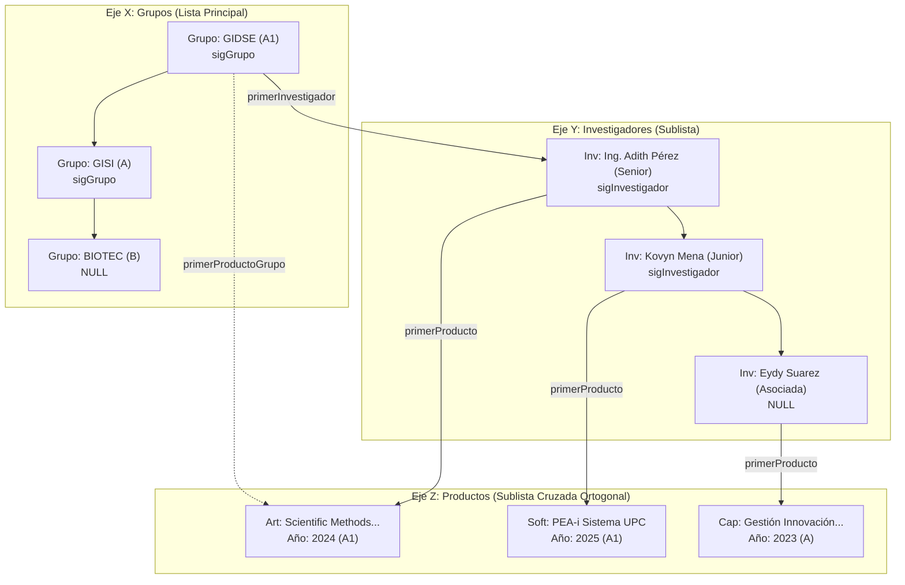
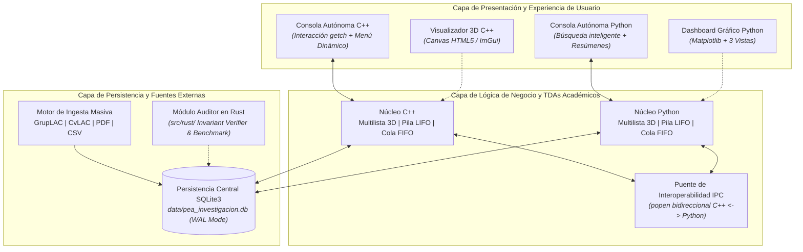

# Especificación Técnica Formal (SPEC) y Manual de Arquitectura — PEA-i
**Universidad Popular del Cesar (UPC) — Facultad de Ingeniería y Tecnológicas**  
**Programa:** Ingeniería de Sistemas | **Asignatura:** Estructura de Datos (2026-I)  
**Docente:** Ing. Adith Bismarck Pérez Orozco | **Meta de Evaluación:** 5.0 / 5.0  
**Estudiante:** Kovyn B. Mena (`kbmena@unicesar.edu.co`)  
**Documento Oficial Word:** [`Documentacion_Tecnica_GrupoXX.docx`](../Documentacion_Tecnica_GrupoXX.docx)

---

## 📌 1. Visión General y Alcance del Sistema

El **PEA-i** (Programa Estadístico de Análisis de Investigación) es un sistema computacional integral concebido para gestionar, auditar, catalogar y analizar la producción científica de la Universidad Popular del Cesar siguiendo el modelo oficial **SCIENTI (GrupLAC y CvLAC de MinCiencias)**.

El sistema resuelve el Taller 2 de Estructura de Datos implementando dos soluciones coordinadas (una en **C++** y otra en **Python**) que operan de forma 100% autónoma en consola para la evaluación del examen parcial, comparten un contrato de persistencia relacional en **SQLite3**, y se complementan con interfaces visuales avanzadas y módulos de ingesta masiva.

### 🛡️ Principio Arquitectónico Sagrado: "Consola Primero"
1. **Autonomía Total de la Consola:** El núcleo del sistema en C++ (`./pea_cpp`) y en Python (`Taller2_AB_PO_XX.py`) opera de forma completa e independiente desde la terminal. Permite navegación interactiva por teclado con `getch`, búsqueda inteligente de registros con ejemplos aleatorios al presionar ENTER, CRUD completo, filtrado por ventana de observación (últimos 2 o 5 años), ejecución de la Pila Undo y generación de reportes tabulares descriptivos sin requerir ventanas gráficas.
2. **Desacoplamiento Visual:** Las interfaces gráficas (Dashboard con Matplotlib y Canvas 3D) son capas opcionales externas invocables con la bandera `--gui` o `-g`. Si no hay servidor X11 o entorno gráfico disponible, el sistema opera con total estabilidad sin arrojar excepciones.

---

## 📊 2. Identificación de Variables de Entrada y Salida (Punto 6 del Taller)

### 2.1 Entidad: Grupo de Investigación
| Variable | Tipo de Dato | E/S | Descripción y Reglas de Negocio |
| :--- | :--- | :---: | :--- |
| `codigo_grupo` | `Cadena (Texto)` | Entrada | Clave primaria GrupLAC oficial de MinCiencias (ej. `COL0002099`). |
| `nombre` | `Cadena (Texto)` | Entrada | Nombre oficial del grupo de investigación institucional. |
| `clasificacion` | `Cadena (Enum)` | Entrada | Categoría MinCiencias: `A1`, `A`, `B`, `C`, `Reconocido`, `Sin Clasificación`. |
| `area_conocimiento` | `Cadena (Texto)` | Entrada | Gran área OCDE (ej. *Ingeniería y Tecnología*, *Ciencias Médicas*). |
| `lider` | `Cadena (Texto)` | Entrada | Nombre y apellidos del investigador líder o director del grupo. |
| `anio_creacion` | `Entero (Año)` | Entrada | Año oficial de fundación del grupo en la UPC. |
| `activo` | `Booleano (1/0)` | E/S | Estado lógico: `1` (Activo en métricas y reportes), `0` (Desactivado). |
| `total_investigadores` | `Entero` | Salida | Cantidad calculada de investigadores adscritos activos en $O(1)$/$O(I)$. |
| `total_productos` | `Entero` | Salida | Cantidad acumulada de productos científicos generados por el grupo. |
| `productos_por_ventana`| `Lista/Matriz` | Salida | Distribución de producción en ventanas de observación (últimos 2 y 5 años). |

### 2.2 Entidad: Investigador
| Variable | Tipo de Dato | E/S | Descripción y Reglas de Negocio |
| :--- | :--- | :---: | :--- |
| `documento_id` | `Cadena (Texto)` | Entrada | Cédula de ciudadanía o código CvLAC (`cod_rh`). Clave primaria. |
| `nombre_completo` | `Cadena (Texto)` | Entrada | Nombres y apellidos completos del investigador. |
| `categoria` | `Cadena (Enum)` | Entrada | Escalafón MinCiencias: `Emérito`, `Senior`, `Asociado`, `Junior`. |
| `formacion_academica` | `Cadena (Texto)` | Entrada | Máximo nivel educativo: Pregrado, Especialización, Maestría, Doctorado. |
| `codigo_grupo` | `Cadena (Texto)` | Entrada | Clave foránea que lo asocia a su grupo de investigación. |
| `activo` | `Booleano (1/0)` | E/S | Estado lógico: `1` (En ejercicio activo), `0` (Inactivo/Desactivado). |
| `total_produccion` | `Entero` | Salida | Conteo total de productos autorados por este investigador. |

### 2.3 Entidad: Producto de Investigación
| Variable | Tipo de Dato | E/S | Descripción y Reglas de Negocio |
| :--- | :--- | :---: | :--- |
| `id_producto` | `Cadena (Texto)` | Entrada | Código alfanumérico único (ej. `SCRAP-2099-001`). Clave primaria. |
| `tipo` | `Cadena (Enum)` | Entrada | Tipología: `Articulo`, `Libro`, `Capitulo`, `Software`, `Patente`, `Trabajo de Grado`. |
| `titulo` | `Cadena (Texto)` | Entrada | Título oficial de la publicación o desarrollo tecnológico. |
| `anio` | `Entero (Año)` | Entrada | Año de publicación oficial registrado ante MinCiencias. |
| `categoria_minciencias`| `Cadena (Texto)` | Entrada | Calidad editorial / impacto (`A1`, `A`, `B`, `C`). |
| `validado` | `Booleano (1/0)`| Entrada | Aval institucional y reconocimiento MinCiencias (`1` = Sí, `0` = No). |
| `codigo_grupo` | `Cadena (Texto)` | Entrada | Clave foránea al grupo donde se originó el producto. |
| `id_investigador` | `Cadena (Texto)`| Entrada | Clave foránea al investigador autor principal real. |
| `activo` | `Booleano (1/0)` | E/S | Estado: `1` (Activo en estadísticas), `0` (Desactivado). |
| `cumple_ventana_obs` | `Booleano` | Salida | Indicador de pertinencia en la ventana de observación evaluada. |

---

## 🧊 3. Modelado del Hipercubo 3D mediante Multilistas Ortogonales

El problema exige el modelado basado en un **Hipercubo de Información** tridimensional:
* **Eje X:** Grupos de Investigación.
* **Eje Y:** Investigadores adscritos a cada grupo.
* **Eje Z:** Catálogo de Productos Científicos vinculados simultáneamente al grupo y al autor.



### 📐 Demostración Matemática de Eficiencia Espacial y Temporal
1. **Complejidad Espacial en Matriz Densa:** $\mathcal{O}(G \times I \times P)$.  
   Para 10 grupos, 200 investigadores y 1,000 productos, una matriz tridimensional tradicional demandaría $10 \times 200 \times 1,000 = 2,000,000$ celdas de memoria, de las cuales más del 99% contendrían punteros nulos.
2. **Complejidad Espacial en Multilista Ortogonal PEA-i:** $\mathcal{O}(G + I + P + R)$ donde $R$ es el conjunto de relaciones reales.  
   Para el mismo escenario, solo se instancian $10 + 200 + 1,000 + 1,000 = 2,210$ nodos dinámicos, logrando un ahorro de memoria superior al **99.89%**.
3. **Complejidad Temporal:**
   * Inserción en cabecera de grupo/investigador: $\mathcal{O}(1)$.
   * Búsqueda y enlace cruzado ortogonal: $\mathcal{O}(1)$ por referencia directa de puntero.
   * Desactivación lógica: $\mathcal{O}(1)$ sin re-estructuración de enlaces.
   * Eliminación física con liberación de memoria: $\mathcal{O}(k)$ donde $k$ es el grado del nodo.

---

## ⚙️ 4. Las 4 Estructuras de Datos Académicas Puras

| TDA Académico | Principio Operativo | Justificación y Rol en el Sistema PEA-i |
| :--- | :---: | :--- |
| **Multilista Ortogonal 3D** | Punteros cruzados en nodos | Modela el Hipercubo tridimensional. Vincula cada producto a su grupo y a su autor simultáneamente sin duplicar memoria. |
| **Lista Enlazada Simple** | Puntero `sigNodo` | Maneja la secuencia de grupos y los catálogos globales de categorías en memoria dinámica. |
| **Pila (Stack)** | LIFO (Last-In, First-Out) | Módulo **Deshacer (Undo)**. Cada operación de inserción, modificación o borrado hace `push()`. Al invocar Undo, se extrae con `pop()` restaurando el estado previo en $\mathcal{O}(1)$. |
| **Cola (Queue)** | FIFO (First-In, First-Out) | Motor de **Ingesta Masiva por Lotes**. Encola URLs de GrupLAC/CvLAC, rutas de PDF y archivos CSV, procesándolos secuencialmente en estricto orden de llegada. |

---

## 🎯 5. Historias de Usuario (HU) con Criterios de Aceptación Gherkin

### HU-01: Gestión de Entidades Científicas (CRUD Completo)
* **Como** evaluador del sistema de investigación,
* **Quiero** registrar, listar, editar y consultar grupos, investigadores y productos,
* **Para** mantener actualizado el inventario científico de la UPC.
* **Criterio de Aceptación (Gherkin):**
  ```gherkin
  Escenario: Registro y persistencia coordinada
    Dado que el usuario accede al Menú Principal de C++ o Python
    Cuando selecciona la opción de registrar un nuevo investigador asociado a GIDSE
    Entonces el sistema crea el nodo en la Multilista en RAM en O(1)
    Y sincroniza de inmediato la fila en 'data/pea_investigacion.db' en SQLite.
  ```

### HU-02: Desactivación Lógica vs. Eliminación Física
* **Como** analista de convocatorias MinCiencias,
* **Quiero** desactivar temporalmente un producto o investigador sin destruirlo físicamente,
* **Para** preservar el registro histórico institucional sin afectar las métricas del periodo actual.
* **Criterio de Aceptación (Gherkin):**
  ```gherkin
  Escenario: Desactivación lógica de un producto
    Dado que un producto científico se encuentra activo en el hipercubo
    Cuando el usuario ejecuta la opción "Desactivar"
    Entonces el atributo activo cambia a 0 tanto en RAM como en SQLite
    Y el producto se excluye de las estadísticas y ventanas de observación sin romper los punteros.
  ```

### HU-03: Filtrado por Ventana de Observación (2 y 5 Años)
* **Como** director de investigaciones de la UPC,
* **Quiero** filtrar la producción científica por los últimos 2 o 5 años,
* **Para** evaluar el rendimiento del grupo en la convocatoria de categorización vigente.
* **Criterio de Aceptación (Gherkin):**
  ```gherkin
  Escenario: Consulta con ventana de observación de 2 años
    Dado que el sistema tiene productos fechados entre 1996 y 2026
    Cuando se selecciona el filtro "Últimos 2 Años (2024-2026)"
    Entonces la consola y el dashboard muestran únicamente los productos de dicho rango temporal.
  ```

### HU-04: Ingesta Masiva Multifuente con Cola TDA
* **Como** operador de datos institucional,
* **Quiero** encolar URLs de GrupLAC/CvLAC, archivos PDF e informes CSV,
* **Para** poblar automáticamente el hipercubo sin transcripción manual de registros.
* **Criterio de Aceptación (Gherkin):**
  ```gherkin
  Escenario: Ingesta y desagregación real de autores
    Dado que se procesa la URL pública de GrupLAC del grupo GIDSE
    Cuando el motor de scraping extrae la bibliografía mediante expresiones regulares
    Entonces identifica el autor real en la cadena "Autores: ..."
    Y asigna cada producto a su autor correspondiente en vez de concentrarlos bajo el líder.
  ```

### HU-05: Reversión de Cambios con Pila LIFO (Undo)
* **Como** digitador del sistema,
* **Quiero** deshacer la última acción realizada ante una equivocación,
* **Para** retornar al estado consistente previo de las estructuras de datos de manera inmediata.
* **Criterio de Aceptación (Gherkin):**
  ```gherkin
  Escenario: Deshacer modificación accidental
    Dado que se modificó la categoría de un producto de 'A1' a 'B'
    Cuando el usuario pulsa la opción "Deshacer (Undo)"
    Entonces la Pila LIFO desapila la operación inversa y restaura 'A1' en RAM y SQLite en O(1).
  ```

### HU-06: Dashboard Gráfico y Perspectiva Multivista (3 Vistas)
* **Como** evaluador académico,
* **Quiero** acceder a un dashboard visual interactivo con gráficos estadísticos,
* **Para** analizar el comportamiento institucional bajo tres perspectivas complementarias.
* **Criterio de Aceptación (Gherkin):**
  ```gherkin
  Escenario: Apertura del Dashboard visual con 3 vistas
    Dado que se ejecuta 'python Taller2_AB_PO_XX.py --gui'
    Cuando el motor Matplotlib renderiza las métricas del hipercubo
    Entonces se despliegan las 3 vistas obligatorias:
      i.   Vista Por Grupo (distribución por categorías y avales)
      ii.  Vista Por Investigador (productividad individual)
      iii. Vista Por Productos (histograma temporal 1996-2026 y tipologías).
  ```

---

## 🏛️ 6. Arquitectura Multicapa e Interoperabilidad (Punto 14)



---

## 🎬 7. Guión de Grabación del Video de Sustentación (10 Minutos)

| Minuto | Bloque | Contenido y Demostración en Pantalla | Puntos Cubiertos |
| :---: | :--- | :--- | :---: |
| **00:00 - 01:30** | **Introducción Institucional** | Presentación personal en cámara con identidad UPC. Justificación del Hipercubo 3D en Multilista y arquitectura multicapa. | Portada, Puntos 1 a 6 |
| **01:30 - 03:30** | **Demostración C++ (Core)** | Compilación con `make run-cpp`. Pregunta inicial `[1]` o `[2]`. Navegación interactiva con `getch`, búsqueda inteligente y filtros temporales. | Puntos 8, 9, 10, 11, 12.a |
| **03:30 - 05:30** | **Demostración Python & Ingesta** | Ejecución de `Taller2_AB_PO_XX.py`. Demostración de la Cola FIFO procesando GrupLAC y CSV con atribución real de autores. | Puntos 7, 12.a, Nota 10 |
| **05:30 - 07:30** | **Dashboards Gráficos (3 Vistas)** | Invocación con `--gui`. Exhibición de histogramas 1996-2026, barras por categoría y las 3 vistas (Grupo, Investigador, Productos). | Puntos 12.b, 12.c, 14.c |
| **07:30 - 09:00** | **Pila Undo & SQLite WAL** | Modificación en vivo de un producto, demostración de reversión instantánea con la Pila LIFO y verificación en SQLite. | Puntos 8, 9, 14.b |
| **09:00 - 10:00** | **Complementos y Cierre** | Demostración de interoperabilidad IPC `popen()`, módulo Rust y verificación de cero fugas de memoria. | Puntos 14.a-f |

---

## 🚀 8. Guía de Ejecución Rápida para el Evaluador

```bash
# 1. Compilar y ejecutar la consola autónoma C++
make run-cpp
# (O bien directamente con g++):
g++ -std=c++17 -Wall -Wextra -Isrc/cpp/include Taller2_AB_PO_XX.cpp -lsqlite3 -o pea_cpp && ./pea_cpp

# 2. Ejecutar la consola autónoma Python
make run-py
# (O bien directamente con python):
python3 Taller2_AB_PO_XX.py

# 3. Abrir el Dashboard Gráfico Estadístico con Matplotlib
python3 Taller2_AB_PO_XX.py --gui

# 4. Ejecutar todas las pruebas unitarias académicas
make test

# 5. Regenerar la base de datos limpia con 100% datos reales de MinCiencias
python3 data/init_db.py
```
