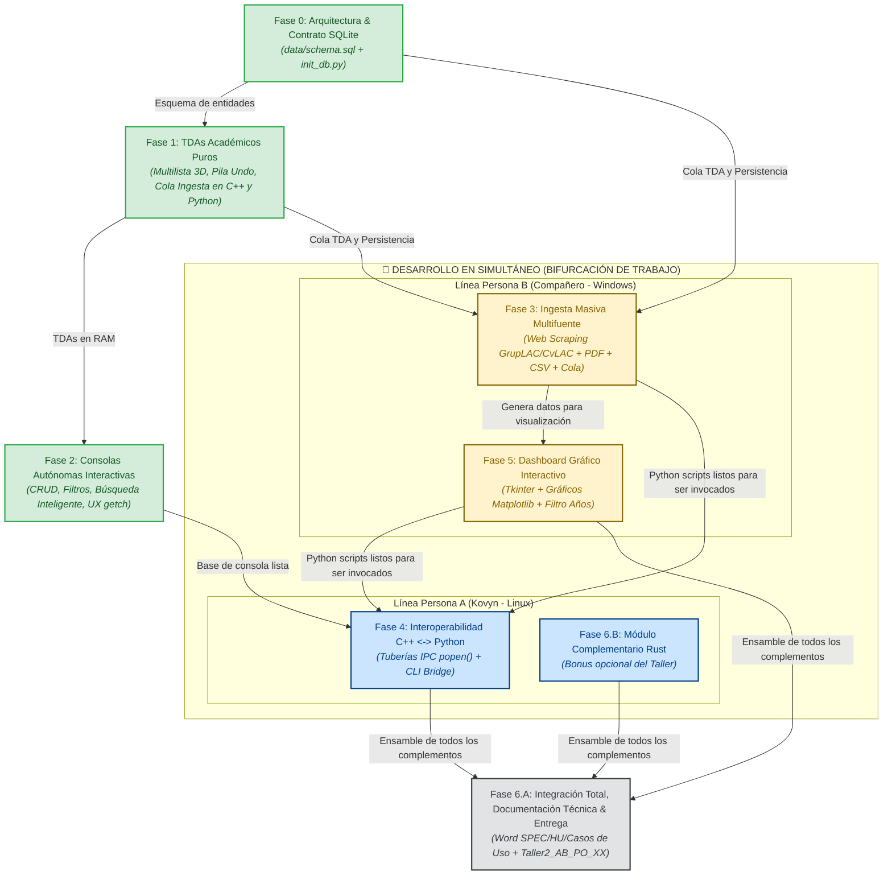

# Guía Maestra de Desarrollo, Arquitectura y Colaboración — PEA-i (Taller 2)
**Universidad Popular del Cesar (UPC) — Facultad de Ingeniería y Tecnológicas**  
**Programa:** Ingeniería de Sistemas | **Asignatura:** Estructura de Datos (2026-I)  
**Docente:** Ing. Adith Pérez | **Meta de Evaluación:** 5.0 / 5.0  

---

## 📌 1. Visión General del Proyecto

El **PEA-i** (Programa Estadístico de Análisis de Investigación) es una solución de software integral creada para gestionar, auditar, analizar y visualizar la producción científica de la Universidad Popular del Cesar siguiendo el modelo nacional **SCIENTI de MinCiencias**.

El taller exige el desarrollo de **dos soluciones de software coordinadas (una en C++ y otra en Python)** que compartan la misma información y la representen en memoria mediante un **Hipercubo de Información** tridimensional implementado con **Estructuras de Datos Académicas Puras basadas en Nodos** (Lista Enlazada, Multilista, Pila y Cola), sin usar colecciones de alto nivel de las librerías estándar.

---

## 🗺️ 2. Mapa Completo de Fases y Grafo de Dependencias

Para comprender el proyecto en su totalidad, la siguiente gráfica y matriz explican el orden cronológico estricto, qué fases ya están finalizadas, cuáles se están desarrollando **en paralelo (simultáneo)** y cómo se conectan entre sí para lograr la calificación máxima (5.0):

### 📊 Diagrama de Dependencias y Flujo de Trabajo



---

### 📋 Matriz Detallada de Fases, Responsables y Concurrencia

| Fase | Nombre y Alcance | Responsable | Estado | Depende de... | Se ejecuta en simultáneo con... | ¿Por qué existe y qué aporta al 5.0? |
| :---: | :--- | :---: | :---: | :---: | :---: | :--- |
| **0** | **Contrato Relacional y SQLite** | Persona A | **Hecho** | Ninguna (Inicio) | — | Crea la única fuente de la verdad (`data/pea_investigacion.db`). Permite que C++ y Python compartan datos sin servidores externos. |
| **1** | **TDAs Académicos Puros (Nodos)** | Persona A | **Hecho** | Fase 0 | — | Implementa el Hipercubo 3D, Pila y Cola desde cero. Cumple la exigencia del docente de prohibir `std::vector` y listas nativas. |
| **2** | **Consolas Autónomas (C++ y Python)** | Persona A | **Hecho** | Fases 0 y 1 | — | Base de consola para el examen parcial. Incluye CRUD, borrado lógico, filtros de años, búsqueda por texto, random con ENTER y navegación instantánea (`getch`). |
| **3** | **Ingesta Masiva (Scraping/PDF/CSV)** | **Persona B** | **EN CURSO** | Fases 0 y 1 | **Fase 4 (Persona A)** | **Punto 7 del Taller:** Descarga automática desde GrupLAC y CvLAC, lectura de informes PDF y archivos CSV usando la Cola TDA. |
| **4** | **Interoperabilidad C++ $\leftrightarrow$ Python** | **Persona A** | **EN CURSO** | Fase 2 | **Fase 3 y 5 (Persona B)** | **Punto 14.d (Complemento 5.0):** Permite que la consola en C++ invoque por debajo el scraping o el dashboard gráfico en Python usando `popen()`. |
| **5** | **Dashboard Gráfico (Tkinter + Matplotlib)** | **Persona B** | **PENDIENTE** | Fases 0 y 3 | **Fase 4 y 6.B (Persona A)** | **Punto 12.b (Obligatorio 4.0):** Presenta histogramas por año, gráficos de barras por categoría MinCiencias y selector de ventana de observación. |
| **6.A**| **Documentación Técnica & Entrega** | **Ambos** | **PENDIENTE** | Fases 3, 4 y 5 | — | **Notas 1 y 2 del Taller:** Documento Word formal con SPEC, Historias de Usuario, Diagramas de Casos de Uso y archivos finales de entrega. |
| **6.B**| **Módulo Opcional Rust (CLI/Bridge)** | **Persona A** | **OPCIONAL** | Fase 2 | Fase 5 (Persona B) | **Punto 14.f (Complemento 5.0):** Pequeño analizador o CLI en Rust para asegurar el 5.0 rotundo frente a cualquier rúbrica. |

---

## 🏛️ 3. Desglose Fase por Fase: ¿Qué se hace y POR QUÉ?

### 🔹 Fase 0: Contrato Relacional y Persistencia Base (SQLite) — [COMPLETADA]
* **Archivos clave:** `data/schema.sql`, `data/init_db.py`, `data/pea_investigacion.db`, `data/muestra_upc.csv`.
* **¿Qué se hizo?:** Se diseñó el esquema relacional con 4 tablas (`Grupos`, `Investigadores`, `Productos`, `HistorialAcciones`) con integridad referencial (`ON DELETE CASCADE`), y un script de inicialización con datos reales de la UPC (grupos GIDSE, GISI, BIOTEC; perfiles reales como el del docente Adith Pérez y productos científicos indexados).
* **¿Por qué esta decisión?:**
  1. *Interoperabilidad sin servidores:* SQLite es un motor embebido en un único archivo (`.db`) que tanto C++ (`libsqlite3`) como Python (`sqlite3`) leen y escriben nativamente sin requerir instalar MySQL o PostgreSQL ni configurar puertos de red.
  2. *Contrato Sagrado:* La base de datos actúa como la **única fuente de la verdad**, garantizando que lo que crea o modifica C++ sea visto de inmediato por Python y viceversa.
  3. *Datos Semilla Reales:* Contar desde el primer día con datos reales de la UPC permite probar consultas, filtros y estadísticas sin tener que tipear datos ficticios manualmente.

---

### 🔹 Fase 1: TDAs Académicos Puros (C++ y Python) — [COMPLETADA]
* **Archivos C++:** `src/cpp/include/Nodo.h`, `Multilista.h`, `Pila.h`, `Cola.h`.
* **Archivos Python:** `src/python/structures/nodos.py`, `multilista.py`, `pila.py`, `cola.py`.
* **Pruebas:** `src/cpp/test_tda.cpp` y `src/python/test_tda.py` (ejecutables con `make test`).
* **¿Qué se hizo?:** Se implementaron desde cero las 4 estructuras exigidas por el docente utilizando únicamente apuntadores/referencias de memoria entre nodos:
  1. **Multilista Ortogonal (Hipercubo 3D):** Nodos con doble enlace ortogonal. `NodoGrupo` apunta horizontalmente al siguiente grupo y verticalmente a su lista de investigadores y productos. A su vez, `NodoProducto` está enlazado simultáneamente al grupo (`sigProductoGrupo`) y al investigador autor (`sigProductoInvestigador`).
  2. **Pila (Stack - LIFO):** Estructura basada en nodos con puntero `siguiente` para el historial de cambios y la función **Deshacer (Undo)**.
  3. **Cola (Queue - FIFO):** Estructura basada en nodos con punteros `frente` y `final` para la ingesta secuencial de datos por lotes.
* **¿Por qué esta decisión?:**
  1. *Exigencia Estricta del Docente:* En Estructura de Datos está terminantemente prohibido usar colecciones de alto nivel como `std::vector`, `std::list` o listas/diccionarios de Python para almacenar las entidades. La evaluación depende de dominar el manejo explícito de punteros y memoria dinámica.
  2. *Eficiencia del Hipercubo:* El modelo multidimensional tradicional en matrices densas desperdiciaría gigabytes de memoria en casillas vacías (matriz dispersa). La Multilista Ortogonal solo consume memoria para las relaciones que realmente existen ($O(1)$ en enlaces cruzados) sin duplicar entidades.

---

### 🔹 Fase 2: Consolas Autónomas Interactivas (C++ y Python) — [COMPLETADA]
* **Archivos C++:** `src/cpp/include/ConsolaApp.h`, `src/cpp/main.cpp`, `Taller2_AB_PO_XX.cpp`.
* **Archivos Python:** `src/python/console.py`, `src/python/main.py`, `Taller2_AB_PO_XX.py`.
* **¿Qué se hizo?:**
  1. **Inicio Flexible (Punto 10 del Taller):** Al arrancar, pregunta si se desea precargar la base de datos SQLite en la Multilista o iniciar con estructuras vacías en memoria RAM.
  2. **CRUD Completo:** Creación, consulta detallada, edición de campos, desactivación (borrado lógico) y eliminación física definitiva para Grupos, Investigadores y Productos.
  3. **Deshacer (Undo) con Pila:** Permite revertir la última acción destructiva o modificación recuperando el estado anterior en $O(1)$.
  4. **Filtro de Ventana de Observación (Punto 10):** Permite filtrar dinámicamente la producción científica por los últimos 2 años, últimos 5 años o cualquier rango arbitrario.
  5. **Resumen Estadístico Descriptivo en Consola (Punto 12.a):** Tablas de indicadores por grupo e investigador.
  6. **Búsqueda Inteligente y Ejemplos Aleatorios:** En las consultas de detalle ya no es obligatorio conocerse ni copiar de memoria los códigos largos. Al escribir parte del nombre (ej. `gidse`, `adith`, `hipercubo`) el sistema lo localiza automáticamente; y si simplemente se presiona **ENTER** en blanco, el sistema selecciona y despliega un ejemplo real al azar.
  7. **Experiencia de Usuario en Terminal (UX):**
     * *Lectura instantánea de tecla (`getch`):* Los menús y pausas responden inmediatamente al presionar una tecla (1, 2, 0, etc.) sin obligar al usuario a presionar ENTER adicional.
     * *Borrado de pantalla automático:* Limpieza fluida entre transiciones de menú (`cls` en Windows, secuencias ANSI en Linux/Mac).
     * *Opción estandarizada de retorno:* Siempre la opción `0` permite regresar al menú anterior o cancelar una operación.
     * *Protección de Copia con Ctrl+C:* Evita que el usuario cierre el programa por accidente al presionar `Ctrl+C` en lugar de `Ctrl+Shift+C` en la terminal.
* **¿Por qué esta decisión?:**
  * La consola es el núcleo que evaluará el docente en el examen parcial de código. Debe ser 100% autónoma, a prueba de fallos y no depender de ninguna ventana gráfica para funcionar.

---

### 🔹 Fase 3: Módulo de Ingesta Masiva y Web Scraping (Python) — [EN CURSO: PERSONA B]
* **Rama asignada:** `feature/ingesta-datos`
* **Archivo a crear:** `src/python/core/ingesta.py`
* **Librerías a usar:** `requests`, `beautifulsoup4`, `pypdf`, `csv` (todas en `requirements.txt`).
* **¿Por qué existe y qué hace?:**
  El Punto 7 del taller exige que el sistema no solo dependa del ingreso manual por teclado, sino que sea capaz de descargar y estructurar automáticamente datos de MinCiencias:
  1. **Web Scraping GrupLAC:** Descarga el HTML oficial del grupo (ej. GIDSE) y extrae: código, nombre, líder, lista de investigadores adscritos y productos registrados.
  2. **Web Scraping CvLAC:** Descarga el currículo del investigador (ej. Ing. Adith Pérez) y extrae su formación, categoría y publicaciones.
  3. **Lector de CSV y PDF:**
     * Lee archivos tabulares como `data/muestra_upc.csv`.
     * Extrae texto de artículos científicos o actas en PDF mediante `pypdf`.
  4. **Procesamiento con la Cola TDA (FIFO):**
     * Cada URL, ruta de archivo CSV o PDF se encola en la `Cola` (`cola.encolar(tipo, origen)`).
     * El procesador atiende la cola (`cola.desencolar()`), extrae los registros e invoca `GestorPersistencia.guardar_en_bd()` para guardarlos en SQLite.
* **¿De qué depende?:** De las Fases 0 (SQLite) y 1 (`Cola` TDA).
* **¿A quién desbloquea?:** Alimenta los datos que mostrará el Dashboard (Fase 5) y proporciona el script que invocará C++ mediante interoperabilidad (Fase 4).

---

### 🔹 Fase 4: Interoperabilidad de Lenguajes C++ $\leftrightarrow$ Python — [EN CURSO: PERSONA A]
* **Rama asignada:** `feature/cpp-interop`
* **Archivos:** `src/cpp/include/ConsolaApp.h`, `src/cpp/include/GestorInterop.h`.
* **¿Por qué existe y qué hace?:**
  El Punto 14.d exige integración e interoperabilidad entre lenguajes para aspirar al 5.0.
  * C++ es rápido y eficiente para algoritmos de memoria en RAM, pero Python tiene las mejores librerías de Web Scraping (`BeautifulSoup`) y visualización (`Matplotlib`).
  * En lugar de obligar al usuario a abrir dos programas por separado, la consola C++ incluirá opciones en su menú para disparar los procesos de Python a través de tuberías del sistema (`popen()`), capturando su salida y recargando automáticamente la Multilista desde SQLite una vez termine la ingesta.
* **¿De qué depende?:** De la Fase 2 (Consola C++) y del contrato CLI de las Fases 3 y 5.
* **¿Se puede hacer en simultáneo con Fase 3?:** **SÍ.** Persona A prepara el puente en C++ definiendo las banderas CLI mientras Persona B programa los scripts en Python.

---

### 🔹 Fase 5: Dashboard Gráfico Interactivo (Tkinter + Matplotlib) — [PENDIENTE: PERSONA B]
* **Rama asignada:** `feature/python-gui`
* **Archivo a crear:** `src/python/gui.py`
* **Librerías a usar:** `tkinter` (nativo) y `matplotlib`.
* **¿Por qué existe y qué hace?:**
  El Punto 12.b exige:
  > *"En Python el programa mostrará un DASHBOARD con la información estadística, histogramas y diagramas de barras. Ejemplo: https://sistemainvestigacion.uniminuto.edu/PGrupos/Ver/141"*
  * Crea una ventana limpia con pestañas (*Grupos*, *Investigadores*, *Productos*, *Métricas*).
  * Incrusta gráficos de `matplotlib`:
    * Gráfico de barras de productos por categoría (`A1`, `A`, `B`, `C`).
    * Histograma de producción científica por año.
  * Incluye controles interactivos para cambiar la ventana de observación (últimos 2 años, 5 años, rango libre) y refrescar los gráficos dinámicamente en pantalla.
* **¿De qué depende?:** De la Fase 0 (lee desde SQLite) y de la Fase 3 (datos alimentados).
* **¿A quién desbloquea?:** A la Fase 6 (documentación con capturas de pantalla reales).

---

### 🔹 Fase 6: Documentación Formal (SPEC/HU), Empaquetado y Bonus Rust — [PENDIENTE: AMBOS]
* **Archivos:** `Documentacion_Tecnica_GrupoXX.docx`, `integrantes.txt`, `Taller2_AB_PO_XX.cpp`, `Taller2_AB_PO_XX.py`, y opcionalmente módulo Rust.
* **¿Por qué existe y qué hace?:**
  * Cumplir con las formalidades de entrega exigidas por el docente antes del plazo:
    1. Documento Word formal con especificación técnica (SPEC), diagrama del Hipercubo, Historias de Usuario (HU) y Diagramas de Casos de Uso.
    2. Archivos ejecutables renombrados con las iniciales de los integrantes (ej. `Taller2_KM_...`).
    3. Asegurar que todos los complementos (Git, SQLite, GUI, Interoperabilidad, Rust) estén verificados al 100%.

---

## 🤝 4. El Contrato de Interoperabilidad (Cómo se Conectan Persona A y Persona B)

Para que el trabajo de Persona A (C++) y Persona B (Python) encaje a la perfección sin ningún error de integración, se ha definido el siguiente **Contrato de Línea de Comandos (CLI)**:

El script principal de Python (`Taller2_AB_PO_XX.py` o `src/python/main.py`) aceptará los siguientes argumentos:

```bash
# Modo 1: Consola interactiva normal (predeterminada)
python Taller2_AB_PO_XX.py

# Modo 2: Lanzar el Dashboard Gráfico Tkinter (Fase 5)
python Taller2_AB_PO_XX.py --gui

# Modo 3: Ejecutar Ingesta Masiva desde URL MinCiencias (Fase 3)
python Taller2_AB_PO_XX.py --scrape-url "https://scienti.minciencias.gov.co/..."

# Modo 4: Ejecutar Ingesta desde archivo CSV o PDF (Fase 3)
python Taller2_AB_PO_XX.py --ingesta-archivo "data/muestra_upc.csv"
```

### ¿Cómo lo usará Persona A en C++?
En el menú de C++, cuando el usuario elija *"Descargar datos de MinCiencias"* o *"Ver Dashboard Visual"*, C++ ejecutará:
```cpp
// Ejemplo de invocación en C++ mediante tubería popen
FILE* pipe = popen("python Taller2_AB_PO_XX.py --gui", "r");
```
De este modo, C++ delega la interfaz gráfica o la descarga a Python de forma transparente, y al cerrarse, C++ recarga los datos actualizados desde `data/pea_investigacion.db`.

---

## 💻 5. Guía de Configuración en Windows (Para Persona B)

Dado que Persona A trabaja en **Linux (CachyOS)** y Persona B trabajará en **Windows**, el proyecto ya fue programado y blindado para ser 100% multiplataforma. Sigue estos pasos para dejar tu entorno listo en Windows:

### 1. Herramientas a Descargar e Instalar en Windows
1. **Git para Windows:** Descargar desde [git-scm.com](https://git-scm.com/).
   * Durante la instalación, en la opción de finales de línea (*Line Ending Conversion*), selecciona:
     `Checkout Windows-style, commit Unix-style line endings` (o ejecuta `git config --global core.autocrlf true`).
2. **Python 3.10 o superior:** Descargar desde [python.org](https://www.python.org/).
   * ⚠️ **IMPORTANTE:** En la primera pantalla del instalador, marcar la casilla **"Add python.exe to PATH"**.
3. **Compilador C++ (MinGW-w64):**
   * Opción recomendada sencilla: [WinLibs](https://winlibs.com/) o [w64devkit](https://github.com/skeeto/w64devkit/releases) (descomprimir y agregar la carpeta `bin` al PATH de Windows).
   * Opcional: También puedes usar **WSL2 (Windows Subsystem for Linux)** o **MSYS2**.
4. **Editor de Código:** [Visual Studio Code](https://code.visualstudio.com/).
   * Extensiones sugeridas en VS Code: *Python*, *C/C++*, y *SQLite Viewer* (para explorar visualmente `data/pea_investigacion.db`).
5. **DB Browser for SQLite (Opcional, muy útil):** [sqlitebrowser.org](https://sqlitebrowser.org/) para ver las tablas y datos con interfaz visual.

---

### 2. Clonar el Repositorio y Configurar Dependencias en Windows
Abre **Git Bash**, **PowerShell** o la terminal de VS Code y ejecuta:

```bash
# 1. Clonar el proyecto
git clone https://github.com/Kovyn-Mena/PEA-I.git
cd PEA-I

# 2. Instalar las librerías de Python requeridas
pip install -r requirements.txt
```

---

### 3. Comandos de Ejecución y Pruebas en Windows

Si tienes instalado `make` (en Git Bash o MSYS2), los comandos son idénticos:
```bash
make test      # Ejecuta todas las pruebas unitarias (C++ y Python)
make run-py    # Ejecuta la consola interactiva en Python
make run-cpp   # Compila y ejecuta la consola C++
```

Si ejecutas directamente desde **CMD** o **PowerShell** de Windows sin `make`:
* **Probar consola Python:**
  ```cmd
  python Taller2_AB_PO_XX.py
  ```
* **Correr pruebas de Python:**
  ```cmd
  python src/python/test_tda.py
  ```
* **Compilar y correr C++ (con MinGW):**
  ```cmd
  g++ -std=c++17 -Wall -Wextra -Isrc/cpp/include src/cpp/main.cpp -o pea_cpp.exe -lsqlite3
  pea_cpp.exe
  ```

> 💡 **Nota sobre Windows y Caracteres Especiales:** El código ya incluye la instrucción automática `chcp 65001` y el manejo de códigos de tecla extendidos de Windows (`msvcrt` y `conio.h`), de modo que tildes, símbolos y flechas funcionarán de inmediato sin romper la consola.

---

## 🔗 6. Enlaces Oficiales del Taller (PDF del Docente) y Recursos de Desarrollo

Para facilitar el desarrollo de la ingesta y la GUI, aquí están los enlaces y referencias exactas extraídas del taller del profesor:

### 🌐 Enlaces Oficiales de Prueba (MinCiencias SCIENTI)
* **Portal SCIENTI de MinCiencias:**  
  [https://minciencias.gov.co/scienti](https://minciencias.gov.co/scienti)
* **URL GrupLAC de prueba obligatoria (Grupo GIDSE UPC):**  
  [https://scienti.minciencias.gov.co/gruplac/jsp/visualiza/visualizagr.jsp?nro=00000000002099](https://scienti.minciencias.gov.co/gruplac/jsp/visualiza/visualizagr.jsp?nro=00000000002099)
* **URL CvLAC de prueba obligatoria (Perfil docente Adith Pérez):**  
  [https://scienti.minciencias.gov.co/cvlac/visualizador/generarCurriculoCv.do?cod_rh=0000494917](https://scienti.minciencias.gov.co/cvlac/visualizador/generarCurriculoCv.do?cod_rh=0000494917)
* **Ejemplo oficial de referencia para el Dashboard (Uniminuto):**  
  [https://sistemainvestigacion.uniminuto.edu/PGrupos/Ver/141](https://sistemainvestigacion.uniminuto.edu/PGrupos/Ver/141)

### 📦 Librerías de Python Utilizadas
Todas están especificadas en `requirements.txt`:
* `requests`: Para descargas HTTP de las páginas de GrupLAC y CvLAC.
* `beautifulsoup4`: Para parsear el HTML y extraer tablas y textos del scraping.
* `pypdf`: Para leer y procesar texto de archivos PDF de investigación.
* `matplotlib`: Para generar gráficos de barras, histogramas y visualizaciones estadísticas.
* Librerías nativas estándar utilizadas: `sqlite3`, `tkinter`, `csv`, `os`, `sys`, `json`.

### 🎨 Identidad Institucional de la UPC (Para el Dashboard y Documentos)
* **Color Verde Institucional:** `#006837`
* **Color Rojo Institucional:** `#ED1C24`
* **Color Blanco / Fondo:** `#FFFFFF` y `#F4F6F9`
* **Tipografías recomendadas:** `Segoe UI`, `Arial`, `Helvetica`

---

## 🌿 7. Flujo de Trabajo en Git (Guía Paso a Paso para Persona B)

Para mantener el repositorio impecable y profesional:

1. **Descargar ramas remotas actualizadas:**
   ```bash
   git fetch origin
   ```
2. **Cambiarse a la rama asignada (ejemplo para Ingesta):**
   ```bash
   git checkout feature/ingesta-datos
   ```
3. **Programar y hacer commits pequeños y claros:**
   ```bash
   git add src/python/core/ingesta.py
   git commit -m "feat(ingesta): implementar parser HTML con BeautifulSoup para GrupLAC"
   ```
4. **Subir los cambios a GitHub:**
   ```bash
   git push origin feature/ingesta-datos
   ```
5. **Crear Pull Request en GitHub:**
   * Entra a [github.com/Kovyn-Mena/PEA-I](https://github.com/Kovyn-Mena/PEA-I).
   * Crea un **Pull Request (PR)** desde `feature/ingesta-datos` **hacia la rama `dev`** (nunca directo a `main`).
   * Persona A revisará el PR, validará que las pruebas pasen y hará el Merge a `dev`.

---

## 🛡️ 8. Reglas de Oro para Todo el Equipo

1. **No tocar `data/schema.sql`:** La base de datos es el contrato común. Si se cambia un nombre de columna, se rompería C++ o Python.
2. **No usar estructuras nativas para almacenar el hipercubo:** La información en RAM **siempre** debe residir en los nodos de la `Multilista`.
3. **La consola nunca debe dejar de funcionar:** Cualquier nueva funcionalidad gráfica o de ingesta debe integrarse como un módulo modular complementario sin alterar la autonomía de la consola.
4. **Validar antes de hacer commit:** Correr siempre `make test` (o `python src/python/test_tda.py`) antes de subir cambios.
