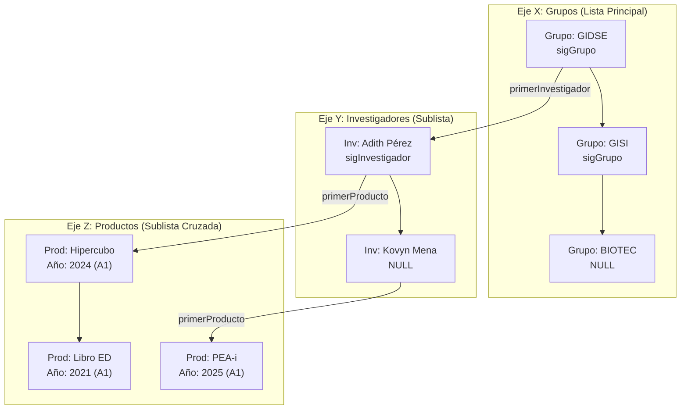

# Especificación Técnica Inicial (SPEC) — Sistema PEA-i
**Universidad Popular del Cesar (UPC)**  
**Facultad de Ingeniería y Tecnológicas — Ingeniería de Sistemas**  
**Asignatura:** Estructura de Datos (Taller 2)  
**Semestre:** 2026-I  
**Docente:** Ing. Adith Pérez  

---

## 1. Introducción y Propósito
El Programa Estadístico de Análisis de Investigación (**PEA-i**) tiene como objetivo gestionar, analizar y presentar la información de investigación científica de la Universidad Popular del Cesar siguiendo el modelo nacional **SCIENTI (MinCiencias)**. 

El sistema implementa dos versiones coordinadas (una en **C++** y otra en **Python**) que comparten un contrato de datos estricto mediante persistencia relacional en **SQLite** y se ejecutan de manera autónoma en consola para evaluaciones académicas, complementándose con interfaces visuales y módulos de ingesta automatizada.

---

## 2. Variables de Entrada y Salida del Modelo (Punto 6 del Taller)

### 2.1 Entidad: Grupo de Investigación
| Variable | Tipo | E/S | Descripción / Restricciones |
| :--- | :--- | :---: | :--- |
| `codigo_grupo` | `Cadena (Texto)` | Entrada | Identificador único nacional GrupLAC (ej. `COL0002099`). Clave Primaria. |
| `nombre` | `Cadena (Texto)` | Entrada | Nombre oficial del grupo institucional. |
| `clasificacion`| `Cadena (Enum)`  | Entrada | Categoría MinCiencias: `A1`, `A`, `B`, `C`, `Reconocido`, `Sin Clasificación`. |
| `area_conocimiento`| `Cadena (Texto)`| Entrada | Gran área OCDE (ej. *Ingeniería y Tecnología*, *Ciencias Médicas*). |
| `lider` | `Cadena (Texto)` | Entrada | Nombre del investigador líder o director. |
| `anio_creacion`| `Entero` | Entrada | Año oficial de fundación del grupo en la institución. |
| `activo` | `Booleano (1/0)` | E/S | Estado lógico: `1` (Activo en reportes), `0` (Desactivado). |
| `total_investigadores` | `Entero` | Salida | Cantidad calculada de investigadores adscritos al grupo. |
| `total_productos` | `Entero` | Salida | Cantidad de productos generados por el grupo. |
| `productos_por_ventana` | `Matriz/Lista` | Salida | Conteo de productos filtrados por ventana de observación (últimos 2 o 5 años). |

### 2.2 Entidad: Investigador
| Variable | Tipo | E/S | Descripción / Restricciones |
| :--- | :--- | :---: | :--- |
| `documento_id` | `Cadena (Texto)` | Entrada | Cédula o identificador único CvLAC (`cod_rh`). Clave Primaria. |
| `nombre_completo` | `Cadena (Texto)` | Entrada | Nombre y apellidos del investigador. |
| `categoria` | `Cadena (Enum)` | Entrada | Categoría científica: `Senior`, `Asociado`, `Junior`, `Sin Categoría`. |
| `formacion_academica` | `Cadena (Texto)` | Entrada | Máximo nivel de escolaridad (Pregrado, Maestría, Doctorado, Postdoc). |
| `codigo_grupo` | `Cadena (Texto)` | Entrada | Clave foránea que lo asocia a su grupo de investigación. |
| `activo` | `Booleano (1/0)` | E/S | Estado: `1` (Activo), `0` (Desactivado). |
| `total_produccion` | `Entero` | Salida | Conteo total de productos autorados por este investigador. |

### 2.3 Entidad: Producto de Investigación
| Variable | Tipo | E/S | Descripción / Restricciones |
| :--- | :--- | :---: | :--- |
| `id_producto` | `Cadena (Texto)` | Entrada | Código alfanumérico único del producto (ej. `PROD-001`). Clave Primaria. |
| `tipo` | `Cadena (Enum)` | Entrada | `Articulo`, `Libro`, `Capitulo`, `Software`, `Patente`, `Trabajo de Grado`. |
| `titulo` | `Cadena (Texto)` | Entrada | Título registrado de la obra o producción técnica. |
| `anio` | `Entero` | Entrada | Año de publicación o registro ante MinCiencias. |
| `categoria_minciencias`| `Cadena` | Entrada | Calidad editorial / impacto (`A1`, `A`, `B`, `C`). |
| `validado` | `Booleano (1/0)`| Entrada | Aval institucional / MinCiencias: `1` (Validado), `0` (No validado). |
| `codigo_grupo` | `Cadena (Texto)` | Entrada | Clave foránea al grupo donde se generó. |
| `id_investigador` | `Cadena (Texto)`| Entrada | Clave foránea al investigador autor principal. |
| `activo` | `Booleano (1/0)` | E/S | Estado: `1` (Activo), `0` (Desactivado). |

---

## 3. Modelo de Estructuras de Datos y el Hipercubo de Información

El problema exige el modelado basado en un **Hipercubo de Información**. Tradicionalmente, un hipercubo en almacenamiento denso consumiría matrices tridimensionales dispersas llenas de valores nulos. Para este proyecto, el hipercubo se modela mediante **Multilistas Ortogonales basadas en Nodos**:



### 3.1 Asignación y Justificación Académica de las 4 Estructuras
1. **Lista Enlazada Simple:**
   * *Uso:* Colección secuencial de grupos y catálogo global de categorías.
   * *Justificación:* Tamaño dinámico en tiempo de ejecución. Permite inserción al inicio en tiempo constante $O(1)$ y búsqueda lineal $O(n)$ sin desperdicio de memoria estática.
2. **Multilista (Hipercubo):**
   * *Uso:* Relación tridimensional Grupo $\leftrightarrow$ Investigador $\leftrightarrow$ Producto.
   * *Justificación:* Modela el hipercubo multidimensional sin duplicar instancias en memoria. Un producto pertenece a un grupo y a un autor mediante punteros enlazados ortogonales.
3. **Pila (Stack - LIFO):**
   * *Uso:* Registro de cambios para la función **Deshacer (Undo)**.
   * *Justificación:* Almacena tuplas de operaciones inversas. Toda creación o modificación hace `push()`. Al invocar "Deshacer", se ejecuta `pop()` sobre el tope revirtiendo el estado anterior de forma inmediata en $O(1)$.
4. **Cola (Queue - FIFO):**
   * *Uso:* Cola de procesamiento por lotes para la ingesta de datos.
   * *Justificación:* Las solicitudes de descarga de URLs (GrupLAC/CvLAC), análisis de archivos PDF y lectura de CSV se encolan con `encolar()` y se despachan secuencialmente con `desencolar()` respetando el orden de llegada de la tarea.

---

## 4. Semántica de Desactivación vs. Eliminación (Puntos 8 y 9)

* **Desactivación (Borrado Lógico):**  
  Modifica el atributo booleano `activo = false` en el nodo y en la base de datos (`activo = 0`). El elemento **permanece en la multilista en memoria**, preservando la integridad referencial histórica, pero queda excluido de los filtros, promedios y reportes estadísticos activos. Puede reactivarse en cualquier momento.
* **Eliminación (Borrado Físico):**  
  Desconecta físicamente los punteros del nodo en la multilista (re-enlazando los nodos adyacentes), libera la memoria explícitamente (`delete` en C++ / desreferenciación en Python) y elimina la fila de SQLite con `DELETE FROM`.

---

## 5. Pregunta Obligatoria de Inicio (Punto 10, Página 3)
Al iniciar cualquiera de las dos aplicaciones (C++ o Python), el primer mensaje en pantalla antes del menú principal es:

```text
=================================================================
             PEA-i: UNIVERSIDAD POPULAR DEL CESAR
=================================================================
Seleccione el modo de inicio del sistema:
  [1] Cargar datos persistidos desde la base de datos (SQLite)
  [2] Iniciar con estructuras de datos en memoria vacías
Opción: _
```

---

## 6. Historias de Usuario (HU) — Resumen para Entrega Final
* **HU-01:** Como usuario, quiero poder registrar grupos, investigadores y productos para mantener actualizado el inventario científico.
* **HU-02:** Como analista de investigación, quiero filtrar la producción por ventana de observación (últimos 2 o 5 años) para evaluar convocatorias de categorización MinCiencias.
* **HU-03:** Como usuario, quiero desactivar temporalmente un producto o investigador sin perder su registro histórico.
* **HU-04:** Como operador, quiero encolar URLs de GrupLAC o archivos CSV/PDF para que el sistema procese automáticamente la información sin entrada manual.
* **HU-05:** Como evaluador, quiero deshacer la última acción realizada mediante la Pila en caso de cometer un error de digitación.
